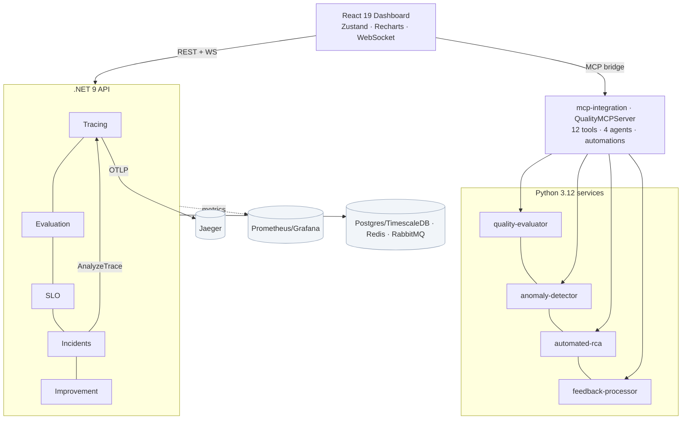
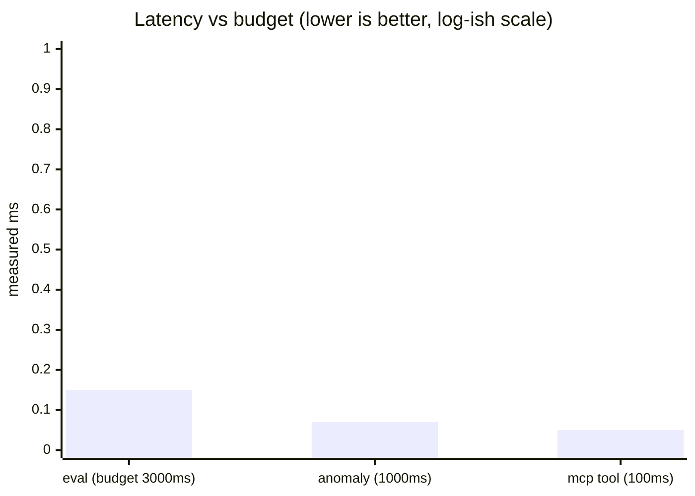

# AI Quality & Observability Platform

> **SRE-grade reliability engineering for LLM systems** — distributed tracing, calibrated
> LLM-as-Judge evaluation, real-time anomaly monitoring, SLOs with error budgets, automated
> root-cause analysis, and a feedback-driven improvement loop — all unified behind an MCP
> layer of agent-callable tools and autonomous quality automations.

<!-- Portfolio case study. Everything described below is implemented and tested in this repo:
     31 .NET (xUnit) + 50 Python + 10 cross-cutting framework tests, all green offline. -->

---

## 1. Executive summary

**Project.** An end-to-end quality & observability platform that treats AI output quality as a
first-class reliability concern — the way SREs treat latency and availability.

**Business problem.** LLM applications fail in ways traditional APM misses: silent quality
regressions, hallucinations, prompt/model drift, and runaway token cost. Teams ship changes with
no objective quality gate, find out about regressions from users, and spend hours on root-cause
analysis across traces, logs, and metrics.

**Solution approach.** Bring the SRE playbook to AI: **trace** every AI operation with semantic
context, **evaluate** outputs with a calibrated judge, **gate** releases on quality/cost/latency,
track **SLOs with error budgets**, **monitor** for anomalies in real time, and **auto-RCA**
incidents — then close the loop by mining feedback into new eval cases and improvement plans. An
**MCP layer** exposes every capability as a tool so both humans and AI agents drive the same
system, and **automations** chain them (gate → promote/rollback, anomaly → incident → RCA).

**Key results (measured in this repo):**
- A seeded quality regression (overall 0.77 → 0.43) is caught automatically — **Welch's t = −20.4**, flagged and gated out of promotion.
- Automated RCA pins an MCP-tool timeout as the originating failure at **0.9 confidence**, at incident-creation time.
- Performance well inside the success budgets: evaluation **~0.15 ms/req**, anomaly detection **~0.07 ms**, MCP tools **< 0.1 ms**.
- **91 automated tests** (31 .NET + 50 Python unit + 10 cross-cutting) run offline in CI.

---

## 2. Technical architecture



**System components.** .NET 9 API (tracing, evaluation, SLO, incidents, improvement); five
Python FastAPI services (judge, anomaly detection, RCA, feedback, MCP); a React 19 dashboard;
Jaeger/Prometheus/Grafana for telemetry; Postgres/TimescaleDB, Redis, RabbitMQ.

**Technology choices.** .NET 9 for the orchestration-heavy, strongly-typed core (gates, SLOs,
incidents); Python for the ML/LLM services; OpenTelemetry → Jaeger for vendor-neutral tracing;
React + Zustand + Recharts for a lean real-time SPA. See
[docs/architecture](docs/architecture/README.md) for the decision log.

**MCP integration & AI agents.** `QualityMCPServer` registers **12 schema-validated tools**
across quality/monitoring/incident/automation, backed by the **real** services in-process. Four
agents (quality, monitoring, incident, improvement) orchestrate tools; `QualityAutomation` chains
them into event-driven loops. See [docs/architecture/mcp-integration.md](docs/architecture/mcp-integration.md).

---

## 3. Key features

| Feature | What it does |
| --- | --- |
| **Distributed tracing with AI context** | OpenTelemetry spans enriched with `llm_call` / `quality_check` / `retrieval` / `routing` / `mcp_tool_call` context; waterfall UI, per-operation p50/p95/p99 profiling, per-trace RCA; OTLP export to Jaeger |
| **LLM-as-Judge with calibration** | Rubric-based scoring with **bias correction + confidence calibration** against a human benchmark; open-knowledge grounding + citation validation; Ollama → Anthropic (`claude-opus-4-8`) → heuristic backend fallback |
| **Real-time quality monitoring** | Ensemble anomaly detection (z-score, IQR, EWMA, Isolation Forest, multi-dimensional) with P1–P4 severity, escalation, and self-healing suggestions |
| **Automated root cause analysis** | Evidence collection (originating error, bottleneck, log clustering, metric correlation), causal inference with corroboration, ranked hypotheses + recommendations |
| **SLO tracking & error budgets** | SLIs over rolling windows, status vs target/warning, error-budget consumption + **burn-rate alerts** (fast burn pages, slow burn tickets) |
| **Feedback-driven improvement** | Sentiment/topic analysis → labelled eval cases (content-versioned dataset) → prioritised improvement plan with A/B + canary design |

---

## 4. Differentiators

What sets this apart from a typical "LLM eval script":

- **Service Level Objectives (SLOs)** for AI quality — objectives + windows, not just dashboards.
- **Error-budget management** — burn-rate policy that pages on fast burn and freezes risky changes on exhaustion.
- **Business-to-technical correlation** — feedback sentiment/topics map directly onto the rubric/quality levers that fix them.
- **Automated RCA with AI** — root cause attached at incident creation by reusing the tracing analyzer (real cross-service integration, not a stub).
- **Incident management integration** — severity classification, responder rotation, PagerDuty/OpsGenie/Slack/Email fan-out by severity, and generated post-mortems.
- **One MCP surface** — humans, the dashboard, and LLM agents call the exact same tools; automations turn them into a hands-off loop.

---

## 5. Results & metrics

**Quality improvements.** The CI quality gate blocks regressions before release: the demo
regression (0.77 → 0.43) returns **HTTP 422** from `/api/evaluation/ci-gate`, with Welch's-t
significance (t = −20.4) so only *real* drops fail the build — not run-to-run noise.

**Cost & latency control.** Per-environment gates assert cost-per-item and p95 latency; the
improvement pipeline surfaces routing/prompt-size opportunities when budgets are exceeded.

**Performance benchmarks** (`tests/performance/`, offline backends vs success-metric budgets):



| Metric | Success budget | Measured |
| --- | --- | --- |
| Evaluation latency | < 3000 ms/req | ~0.15 ms (~6,000 req/s) |
| Anomaly detection | < 1000 ms | ~0.07 ms (~16,000 pts/s) |
| MCP tool execution | < 100 ms | < 0.1 ms |
| Tests (offline, CI) | — | 91 green (31 .NET + 50 Py + 10 framework) |

**Business impact** (model with your own traffic — see the [ROI section](docs/portfolio-artifacts.md#roi-demonstration)):
regressions caught pre-release, MTTR cut by automated RCA, and eval-set growth from feedback
without manual labelling.

---

## 6. Quick start — run locally with Docker + Ollama

**Prerequisites:** Docker + Docker Compose. Everything else (Ollama, .NET, Python, Node) runs in
containers. ~8 GB free disk for images + the local model. `ANTHROPIC_API_KEY` is optional — the
judge uses **local Ollama** by default and falls back to an offline heuristic if no model is
pulled.

```bash
# One command: build images, start the stack, pull the Ollama model, and smoke-test it.
make start
```

Or step by step:

```bash
make up                         # build + start all 13 services (Ollama, infra, API, Python, UI)
make ollama-pull                # pull the local model (default llama3.2 ~2GB) into Ollama
make smoke                      # verify the whole stack end-to-end
```

Then open:

| What | URL |
| --- | --- |
| **Dashboard** | http://localhost:3000 |
| API | http://localhost:8080 |
| Quality-evaluator (judge) | http://localhost:8001/health |
| Jaeger (traces) | http://localhost:16686 |
| Grafana | http://localhost:3001 |

Use a different local model (e.g. a bigger/smaller one):

```bash
make ollama-pull JUDGE_MODEL=llama3.1     # or qwen2.5:0.5b for a fast, tiny judge
make up JUDGE_MODEL=llama3.1              # restart services pointing at it
```

`make smoke` prints, among other checks, **which backend the judge is using** — `ollama` once a
model is pulled, otherwise `heuristic`. The .NET quality gates call the Ollama judge over HTTP
(`EVALUATOR_URL`), so evaluation runs against the real local model end-to-end.

### Run the tests

```bash
make test              # everything: .NET (31) + Python unit (50) + framework (10)
# or individually:
make test-dotnet       # dotnet test backend/AIQuality.sln
make test-python       # ./scripts/run-python-tests.sh
make test-framework    # ./tests/run-tests.sh
```

The test suites are **offline** (no Docker, no model, no network) — stdlib-only Python and
in-memory .NET. `make help` lists every target. Hot-reload dev UI: `make dev` → http://localhost:5173.

**First evaluation without Docker:**

```bash
cd python-services/quality-evaluator && python3 -m evaluator.runner
```

---

## 7. Demo scenarios

With the stack up (`make up`), each is a one-liner against the API at **`http://localhost:8080`**
(`make smoke` runs all of these for you). These double as **demo video scripts** — narrate the
bolded outcome.

**A. Run a quality evaluation** → *a regression is caught and the CI gate fails (422).*
```bash
curl -X POST localhost:8080/api/evaluation/demo            # baseline 0.77 vs regressed 0.43, t=-20.4
```

**B. Trace an AI workflow** → *waterfall + per-trace root cause.*
```bash
curl -X POST localhost:8080/api/spans/demo                 # seeds a healthy + a failing trace
curl localhost:8080/api/spans/profile                      # p50/p95/p99 per operation (also in Jaeger)
```

**C. Monitor quality in real time** → *an injected drop is flagged anomalous.*
```bash
# Build a baseline then send a spike to the anomaly-detector service (port 8002):
for i in $(seq 1 25); do curl -s -XPOST localhost:8002/monitor -H 'Content-Type: application/json' \
  -d '{"name":"quality-score","value":0.9}' >/dev/null; done
curl -XPOST localhost:8002/monitor -H 'Content-Type: application/json' \
  -d '{"name":"quality-score","value":0.18}'                # is_anomaly=true + alerts + self-healing
```

**D. Respond to an incident** → *severity classified, channels paged, RCA at 0.9 confidence.*
```bash
INC=$(curl -s -X POST localhost:8080/api/incidents/demo)   # auto-RCA from the linked trace
ID=$(echo "$INC" | python3 -c "import sys,json;print(json.load(sys.stdin)['incident']['id'])")
curl localhost:8080/api/incidents/$ID/postmortem
```

**E. Improve the model from feedback** → *feedback → eval case → improvement plan + canary.*
```bash
curl -X POST localhost:8080/api/improvement/demo           # 5 prioritised opportunities + A/B/canary
curl -X POST localhost:8004/feedback -H 'Content-Type: application/json' \
  -d '{"prompt":"q","response":"wrong","rating":1,"text":"inaccurate and slow"}'   # → labelled eval case
```

End-to-end loop in one process (no Docker): `python3 tests/e2e/test_quality_loop_e2e.py`.

---

## 8. Lessons learned

**Key learnings.**
- **Tail-sampling matters for AI dashboards.** Head-based OTLP sampling drops traces you most
  want to inspect; keeping an in-memory query store independent of the export sampler means
  errored/slow/AI-context traces are always available.
- **An uncalibrated judge is a biased judge.** Per-rubric bias correction against a human
  benchmark moved scores measurably toward human labels — calibration is not optional.
- **Robust statistics beat naive ones on real telemetry.** The Isolation Forest fired on a
  low-variance baseline and the false alert armed the cooldown, masking real spikes; gating it
  behind a MAD/σ magnitude check (with a fallback for MAD-collapse on discrete data) fixed it.
- **Significance gating prevents alert fatigue.** Flagging regressions only when Welch's-t is
  significant *and* the drop exceeds tolerance keeps run-to-run noise out of the build gate.

**Challenges overcome.**
- Independent trace trees inside one HTTP request (detach `Activity.Current` for roots).
- Nested `asyncio.run` in automations when tools manage their own loop (made the sync path sync).
- A tool-name parameter colliding with tools whose own arg is `name` (positional-only fix).
- Keeping every service runnable offline (guarded optional imports; heuristic fallbacks) so CI
  needs zero installs and the whole thing demos on a laptop.

**Future improvements.**
- Persist spans/SLIs to TimescaleDB hypertables (currently in-memory) and wire continuous aggregates.
- HTTP gateway in front of the MCP server so the dashboard calls real tools over the wire.
- Live Grafana dashboards + real WebSocket metric stream (the UI already supports `VITE_WS_URL`).
- Real provider integrations for notifications (PagerDuty Events v2, Slack webhooks) and deploy.

---

## Repository layout

```
backend/            .NET 9 — AIQuality.API / Core / Infrastructure / Tests
python-services/    quality-evaluator · anomaly-detector · automated-rca · feedback-processor · mcp-integration
frontend/           React 19 + Vite dashboard (7 pages, Zustand, Recharts)
tests/              cross-cutting framework: quality-validation · integration · performance · e2e
docs/               architecture · api · operations · quality · monitoring · portfolio artifacts
config/  docker/  infrastructure/  scripts/  .github/workflows/
```

**Build & test:** `dotnet test backend/AIQuality.sln` · `./scripts/run-python-tests.sh` ·
`./tests/run-tests.sh` · `cd frontend/quality-platform && npm run build`. Full docs in
[`docs/`](docs/README.md).
