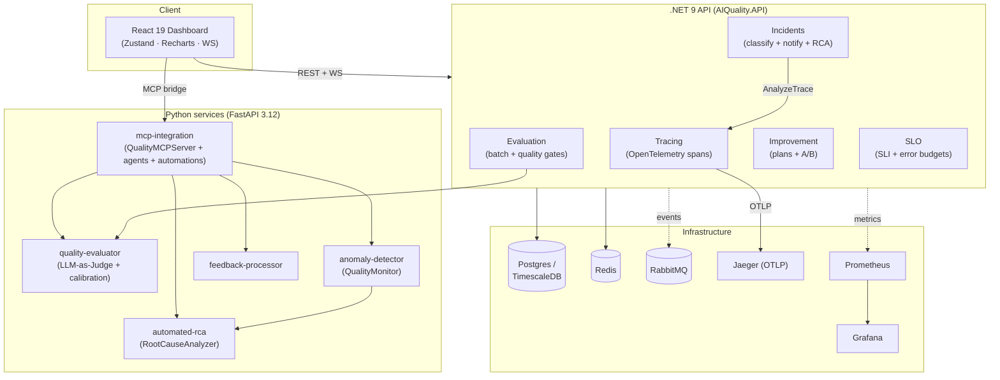
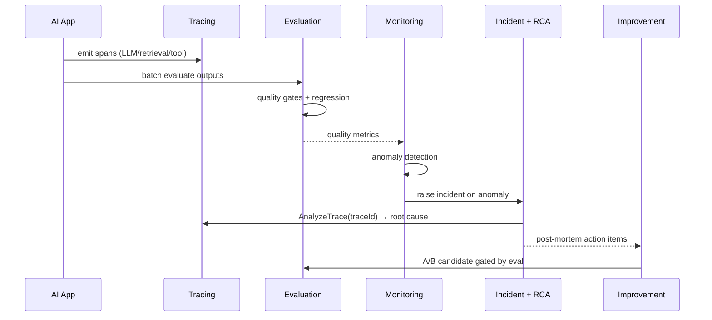

# Architecture

The AI Quality & Observability Platform unifies **tracing, evaluation, monitoring, SLOs,
incidents, and feedback** for LLM systems, with an **MCP layer** that turns every capability
into an agent-callable tool and ties them into autonomous quality automations.

## System architecture

## Component responsibilities

| Component | Responsibility |
| --- | --- |
| **Tracing** (`TracingService`) | OpenTelemetry `ActivitySource` spans with AI context (LLM call, quality check, retrieval, routing, MCP tool); in-memory query store; waterfall/profile/RCA APIs; OTLP export to Jaeger |
| **Evaluation** (`EvaluationService`) | Parallel batch evaluation, per-environment quality gates, Welch's-t regression detection, CI/CD gate |
| **Improvement** (`ImprovementService`) | Reads eval history → opportunities (prompt/model/KB/config/cost) → A/B + canary experiment |
| **SLO** (`SLOService`) | SLI windows, status vs target/warning, error budget + burn-rate alerts |
| **Incidents** (`IncidentService`) | Severity classification, responder assignment, notification fan-out, **automated RCA via the tracing analyzer**, post-mortems |
| **quality-evaluator** | Calibrated LLM-as-Judge (Ollama→Anthropic→heuristic), rubrics, open-knowledge verification |
| **anomaly-detector** | Ensemble anomaly detection, alerting/escalation, SLO tracking, self-healing suggestions |
| **automated-rca** | Evidence collection, causal inference, recommendations, incident management |
| **feedback-processor** | Sentiment/topics, eval-case generation, dataset versioning |
| **mcp-integration** | `QualityMCPServer` (12 tools), 4 AI agents, `QualityAutomation` (gate/monitoring/improvement/incident) |

## Data flow — the quality loop

## Technology stack decisions

| Choice | Why |
| --- | --- |
| **.NET 9** for the core API | Strong typing + DI for the orchestration-heavy services (gates, SLOs, incidents); first-class OpenTelemetry |
| **Python 3.12** for AI services | The ML/LLM ecosystem (judge, anomaly detection, RCA) lives in Python; FastAPI for thin HTTP |
| **OpenTelemetry → Jaeger** | Vendor-neutral tracing; `Activity == OTel span`, so traces export anywhere |
| **MCP** | One uniform tool/agent interface over every capability — humans and LLM agents call the same tools |
| **Ollama→Anthropic→heuristic** judge fallback | Runs on a laptop (Ollama), in prod (Claude `claude-opus-4-8`), and in CI (offline heuristic) with no code change |
| **React 19 + Zustand + Recharts** | Lean SPA; Zustand for real-time state, Recharts for the visualizations, no router dependency |
| **TimescaleDB** (prod) for spans/SLIs | Hypertables + continuous aggregates fit append-heavy time-series telemetry |

See [MCP integration](mcp-integration.md) for the agent/automation architecture.
