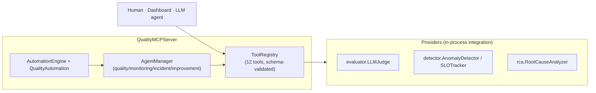

# MCP Integration Architecture

The `mcp-integration` service (`QualityMCPServer`) is the connective tissue: it exposes every
platform capability as an **MCP tool**, drives them with **AI agents**, and chains them into
**event-driven automations**. The same tools are callable by a human, the dashboard, or an LLM
agent — one uniform surface.

## Tools (12)

| Category | Tools |
| --- | --- |
| **quality** | `evaluate_output`, `check_gate`, `run_benchmark`, `analyze_trace`, `detect_anomaly` |
| **monitoring** | `check_slo`, `get_metrics`, `query_dashboard` |
| **incident** | `create_incident`, `escalate_incident`, `resolve_incident`, `postmortem_analyze` |
| **automation** | `list_automations`, `run_automation` |

Each tool is a `ToolSpec` (name, JSON-schema, handler). The registry validates required args
before dispatch; the tool-name parameter is positional-only so tools whose own args are named
`name` (e.g. `detect_anomaly`) don't collide.

## Agents

| Agent | Behaviour |
| --- | --- |
| **Quality** | `evaluate_output` → `check_gate`; flags failing outputs for review |
| **Monitoring** | `detect_anomaly` + `check_slo`; emits `raise_incident` on anomaly |
| **Incident** | `create_incident` → `postmortem_analyze` → auto-escalate severe, confident cases |
| **Improvement** | `run_benchmark`; proposes levers when below target |

## Automations (event-driven)

`QualityAutomation` = `TriggerManager` + `ActionExecutor` (ctx-threaded, dry-run aware) +
`AutomationMonitor`. `execute(trigger)` runs **check → plan → execute → monitor**.

| Trigger | Automation | Plan |
| --- | --- | --- |
| `evaluation_complete` | quality-gate | gate → **auto-promote** on pass / **auto-rollback** on fail → report |
| `metric_received` | monitoring | detect → investigate/incident → self-heal suggestions |
| `benchmark_complete` | improvement | benchmark → A/B test + KB update when below target |
| `anomaly_detected` | incident-response | triage (create + RCA + escalate) → remediation recommendation |

Side-effecting actions (`promote`, `rollback`, `start_ab_test`, `update_model`,
`update_knowledge_base`) are simulated under `dry_run` so plans are safe to test.

## Why in-process providers?

The providers import the sibling service packages directly (`evaluator`, `detector`, `rca`)
with self-contained fallbacks. This keeps the demo runnable with zero infrastructure while
exercising the **real** service logic. In production each provider call becomes an HTTP request
to the corresponding FastAPI service — the tool contracts are identical.
