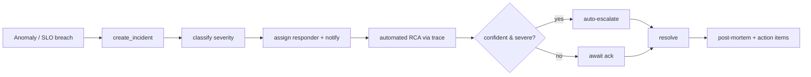

# Operations Guide

## Deployment

### Local (Docker Compose)

```bash
cp .env.example .env          # fill in secrets (ANTHROPIC_API_KEY optional)
make up                       # base stack: postgres, redis, rabbitmq, prometheus, grafana, jaeger, api
make dev                      # dev overlay: hot reload + python services + frontend (Vite)
make prod                     # production-like overlay (pre-built images, restart policies)
make down                     # stop
```

| Service | URL |
| --- | --- |
| API | http://localhost:8080 (compose) / http://localhost:5099 (`dotnet run`) |
| Frontend (dev) | http://localhost:5173 |
| Jaeger UI | http://localhost:16686 |
| Prometheus | http://localhost:9090 |
| Grafana | http://localhost:3001 |
| RabbitMQ mgmt | http://localhost:15672 |

### CI/CD

`.github/workflows/quality-ci.yml` runs on every push/PR: backend (`dotnet test`), python (unit
+ framework suites), frontend (vite build), then the quality gate.
`observability-cd.yml` publishes the API, builds the frontend, and validates the compose stacks;
the tag-gated `deploy` job is where image push / `terraform apply` go.

## Configuration

| File | Purpose |
| --- | --- |
| `.env` | Secrets + connection strings (see `.env.example`) |
| `backend/AIQuality.API/appsettings.json` | Connection strings, Redis, OpenTelemetry endpoint |
| `config/quality/quality-gates.yaml` | Quality gate thresholds (validated by `scripts/deploy-quality-gates.sh`) |
| `config/quality/evaluation-rubrics.yaml` | Judge rubrics |
| `config/quality/calibration-sets.yaml` | Human calibration sets |
| `config/slo/slo-definitions.yaml` | SLO targets and windows |
| `config/slo/error-budgets.yaml` | Error-budget burn alert policy |
| `config/monitoring/prometheus.yml` | Scrape config |
| `config/monitoring/alerts.yaml` | Alert rules |

Key environment variables: `OpenTelemetry__Endpoint` (OTLP→Jaeger), `ANTHROPIC_API_KEY` +
`JUDGE_MODEL` (judge backend), `POSTGRES_*`, `REDIS_*`, `RABBITMQ_*`, `MCP_SERVER_PORT`.

## Monitoring setup

1. **Traces** export via OTLP to Jaeger (`OpenTelemetry__Endpoint=http://jaeger:4317`). Sampling
   is `ParentBased(TraceIdRatioBased)`; the in-memory query store keeps unsampled traces for the
   dashboard (tail-sampling).
2. **Metrics** scrape into Prometheus; Grafana dashboards live in `config/monitoring/grafana-dashboards/`.
3. **Quality metrics** flow from the evaluator into the monitoring service; the SLO service tracks
   SLIs and error budgets.

## Alert configuration

- **Anomaly alerts** (anomaly-detector): rules map detector severity (P1–P4) to escalation routes
  (PagerDuty/Slack/email) with a cooldown to de-dupe. See `AlertManager` / `EscalationPolicy`.
- **Error-budget alerts** (SLO service): fast burn (≥14.4×) pages; slow burn (≥6×) opens a ticket;
  exhaustion freezes risky changes.
- **Prometheus alerts**: `config/monitoring/alerts.yaml` (e.g. `HighErrorRate`).

## Incident response



- **Create**: `POST /api/incidents` (or the `incident-response` automation on `anomaly_detected`).
- **Severity** is classified from blast radius (error spans, critical logs, metric deviation).
- **RCA** runs automatically when a `traceId` is attached (uses the tracing analyzer).
- **Notifications** fan out by severity: PagerDuty/OpsGenie (Sev1–2), Slack (all), Email (Sev1–3).
- **Post-mortem**: `GET /api/incidents/{id}/postmortem` → timeline, root cause, action items.
  Template in [portfolio artifacts](../portfolio-artifacts.md#post-mortem-template).

## Runbooks (referenced by the RCA knowledge base)

| Pattern | Action |
| --- | --- |
| `dependency_timeout` | Timeout + retry + circuit-breaker around the downstream tool |
| `cascading_failure` | Isolate the originating failure; add bulkheads |
| `quality_regression` | Roll back model/prompt; re-run quality gates before re-deploy |
| `latency_spike` | Scale out / optimise the bottleneck; check noisy-neighbour load |
| `change_induced` | Roll back or flag off the correlated change; verify recovery |
