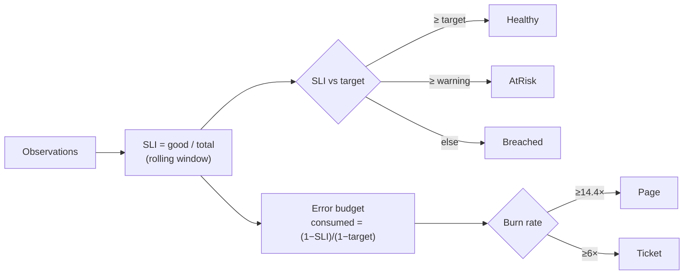

# Portfolio Artifacts

Reusable artifacts that demonstrate SRE-grade quality practice applied to AI systems.

## SLO / SLI dashboard

The dashboard's **SLO** page renders the live compliance snapshot (`GET /api/slo`): per-SLO SLI
vs objective, status (Healthy/AtRisk/Breached), and error-budget bars with burn rate.



Sample (`POST /api/slo/demo`):

| SLO | Type | SLI | Target | Status | Budget left | Burn |
| --- | --- | --- | --- | --- | --- | --- |
| api-availability | Availability | 100.0% | 99.9% | Healthy | 100% | 0× |
| quality-score | Quality | 98.0% | 95.0% | Healthy | 60% | 0.4× |
| eval-latency | Latency | 94.5% | 99.0% | **Breached** | 0% | 5.5× |

## Incident post-mortem template

Generated by `GET /api/incidents/{id}/postmortem`. Structure:

```markdown
# Post-mortem: <INCIDENT-ID> — <title>

- **Severity:** Sev1
- **Status:** Resolved
- **Duration:** opened → resolved

## What happened
<root cause from automated RCA + narrative>

## Timeline
- 08:12 Opened Sev1, assigned to <responder>
- 08:12 Automated RCA: '<originating failure>' (90% confidence)
- 08:13 Notified pagerduty/slack/email
- 08:20 Escalated to incident-commander
- 08:41 Resolved: <resolution>

## Root cause
<originating failure span / dependency / change>

## Action items
- [ ] <from RCA recommendations>
- [ ] Add a regression test / monitor for this failure mode
- [ ] Verify alerting fired promptly and routed correctly

## Follow-ups
- [ ] <prevention / resilience work>
```

## Quality trend analysis

The **Evaluation** and **Overview** pages chart `overall` and `passRate` across runs, with
regression detection (Welch's t-test) flagging significant drops. Worked example
(`POST /api/evaluation/demo`): baseline overall **0.767** → regressed **0.425**, **t = −20.4**,
flagged as a significant regression with a quality alert.

```mermaid
xychart-beta
    title "Quality overall by run"
    x-axis [r1, r2, r3, r4, r5, r6, r7, r8]
    y-axis "overall" 0 --> 1
    line [0.78, 0.80, 0.79, 0.82, 0.81, 0.84, 0.83, 0.43]
```

The final point is the seeded regression — caught automatically and gated out of promotion.

## ROI demonstration

The platform's ROI comes from **catching quality/latency/cost regressions before users do** and
**collapsing MTTR** with automated RCA. A simple model (substitute your own traffic):

| Lever | Mechanism | Illustrative impact |
| --- | --- | --- |
| Regression prevention | CI quality gate blocks a bad release (422) | Avoids a user-facing quality incident per blocked release |
| Faster RCA | Automated root cause at incident creation (~0.9 confidence) | Cuts investigation from ~hours to minutes (MTTR ↓) |
| Cost control | Cost-per-item gate + routing opportunities | Flags spend above budget; routes simple queries to cheaper models |
| Eval automation | Negative feedback → labelled eval cases | Eval-set growth without manual labelling |

> Numbers above are illustrative placeholders. Plug in your request volume, incident frequency,
> and on-call cost to produce a concrete figure; the platform supplies the measured inputs
> (pass rate, MTTR proxy, cost/item, budget burn).

## Performance benchmarks

From `tests/performance/` (offline backends, asserted against success-metric budgets):

| Operation | Budget | Measured |
| --- | --- | --- |
| Evaluation latency | < 3000 ms | ~0.15 ms/req (~6,000 req/s) |
| Anomaly detection | < 1000 ms | ~0.07 ms (~16,000 pts/s) |
| MCP tool execution | < 100 ms | < 0.1 ms |
| Trace analysis (200 spans) | linear | ~0.024 ms |
