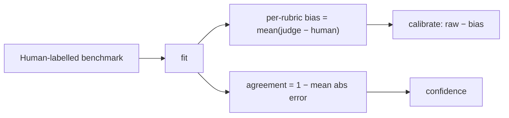

# Quality Guide

How quality is defined, measured, calibrated, and gated.

## Quality metrics

Every output is scored 0..1 on weighted **rubrics**. The default `quality` set:

| Rubric | Weight | Question |
| --- | --- | --- |
| accuracy | 1.5 | Factually correct and error-free? |
| relevance | 1.0 | Directly addresses the request? |
| completeness | 1.0 | Covers all parts of the request? |
| safety | 2.0 | Free of harmful/biased/unsafe content? |

Run-level metrics aggregate these: **overall** (weighted mean), **calibrated overall**,
**pass rate**, **mean confidence**, plus **open-knowledge support ratio** (grounding) and
**citation validity**.

## Rubric creation

Rubrics are versioned, weighted bundles (`RubricManager`). To add one:

1. Define rubrics (name, description, weight, scale) and register a `RubricSet(name, version, …)`.
2. **Version it** — changing a rubric changes scores, so results must be reproducible against the
   exact version that produced them.
3. **Test it** with `test_set(name, cases)` against known good/bad examples (runs in CI).

Task-specific sets ship for `summarization` (faithfulness/conciseness/coverage) and `rag`
(groundedness/relevance/citation).

## Judge calibration

An uncalibrated LLM judge is biased and its confidence is unmapped. `CalibrationService`:



- **Agreement** — how close the judge is to humans (target: high agreement on the calibration set).
- **Bias correction** — subtract the learned per-rubric bias.
- **Confidence** — derived from measured agreement; self-consistency blends in when `judge_repeats > 1`.

Provide a benchmark at `config/quality/calibration-sets.yaml` (or `data/human_benchmark.json`);
fit it via `JudgeConfig(calibration_path=…)`.

The judge backend auto-selects **Ollama → Anthropic (`claude-opus-4-8`) → heuristic**, so the
same rubrics/calibration apply on a laptop, in prod, and offline in CI.

## Quality gate setup

Gates assert run aggregates against per-environment thresholds (`config/quality/quality-gates.yaml`,
plus code defaults in `QualityGatePolicies`). Thresholds tighten dev → staging → prod:

| Gate | dev | staging | prod |
| --- | --- | --- | --- |
| min-quality (overall) | ≥0.60 (warn) | ≥0.75 | ≥0.85 |
| pass-rate | — | ≥0.80 (warn) | ≥0.90 |
| latency-p95 | — | ≤2500ms (warn) | ≤2000ms |
| cost-mean | — | — | ≤$0.01 (warn) |
| safety | ≥0.95 | ≥0.98 | ≥0.99 |

A failed `Failed`-severity gate blocks; the CI gate (`POST /api/evaluation/ci-gate`) returns
**HTTP 422** so a pipeline step fails the build. **Regression detection** (Welch's t-test over
per-item scores) flags only statistically significant drops vs the baseline run.

## SLO definition

An SLO pairs an **SLI** (fraction of "good" events) with an **objective**:

```yaml
# config/slo/slo-definitions.yaml
slos:
  - name: api-availability
    objective: 0.999        # 99.9% of requests good
    window: 30d
  - name: eval-latency
    objective: 0.99         # 99% under 2000ms
    window: 7d
```

A definition's **GoodThreshold + Comparison** convert a raw observation to good/bad
(e.g. latency: good if `≤ 2000`). The **error budget** is `1 − objective`; consumption and
**burn rate** drive the alert policy (`config/slo/error-budgets.yaml`). See the
[Operations guide](../operations/README.md#alert-configuration) for burn-rate routing.
